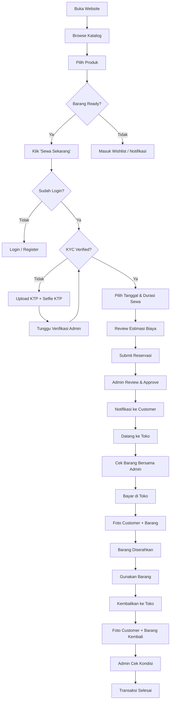
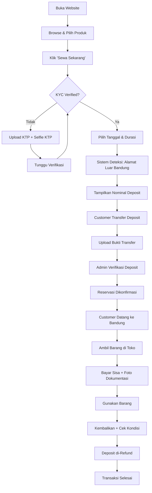
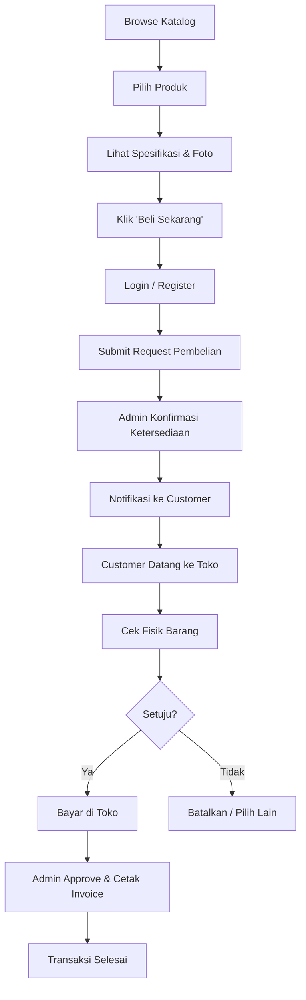
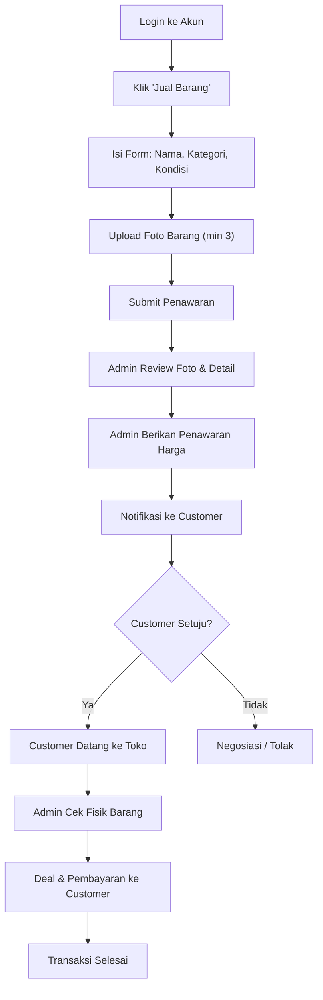
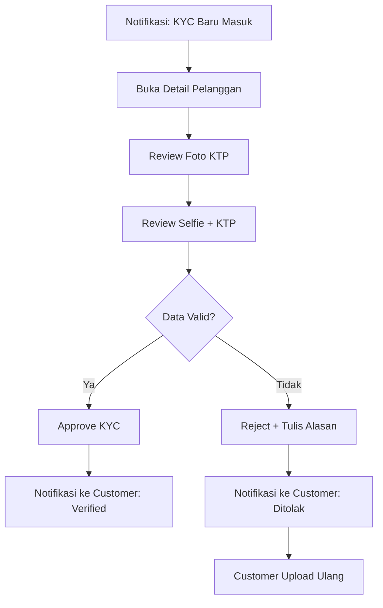

# 📋 Product Requirements Document (PRD)
# **GadgetVault** — Platform Jual, Beli & Sewa Gadget

> **Versi:** 1.0  
> **Tanggal:** 8 Juni 2026  
> **Status:** Draft — Menunggu Review  

---

## 1. Executive Summary

**GadgetVault** adalah platform web untuk toko gadget fisik di Bandung yang melayani **jual**, **beli**, dan **sewa** perangkat elektronik (HP, kamera, drone, dan aksesoris). Aplikasi ini menghubungkan pelanggan dengan toko melalui pengalaman digital yang elegan, dengan sistem KYC terintegrasi, manajemen stok real-time, serta admin dashboard lengkap.

> [!IMPORTANT]
> Semua transaksi bersifat **offline-first** — pembayaran dan serah-terima barang dilakukan langsung di toko setelah verifikasi dan approval admin. Untuk pelanggan luar Bandung, tersedia sistem **deposit** sebagai jaminan reservasi.

---

## 2. Goals & Objectives

### 2.1 Business Goals

| # | Goal | KPI |
|---|------|-----|
| 1 | Meningkatkan visibilitas toko secara online | Organic traffic ≥ 1.000 visitor/bulan dalam 3 bulan |
| 2 | Mempermudah proses sewa-menyewa | Waktu proses sewa berkurang 50% vs manual |
| 3 | Mengurangi risiko kehilangan barang sewa | 100% penyewa terverifikasi KYC |
| 4 | Memperluas jangkauan ke luar Bandung | 20% transaksi dari luar kota dalam 6 bulan |
| 5 | Membangun kepercayaan pelanggan | Rating kepuasan ≥ 4.5/5 |

### 2.2 User Goals

- **Pembeli**: Melihat katalog lengkap dengan spesifikasi dan foto, lalu datang ke toko untuk membeli
- **Penyewa**: Mengecek ketersediaan barang, reservasi online, upload KYC, lalu ambil di toko
- **Penjual**: Menjual/tukar-tambah gadget bekas ke toko dengan proses transparan
- **Admin**: Mengelola seluruh operasional toko dari satu dashboard

### 2.3 Product Goals

- SEO-friendly untuk pencarian lokal (contoh: "sewa kamera Bandung")
- Fully responsive (mobile-first)
- Interaktif tinggi dengan animasi halus
- Desain mewah dan elegan tanpa kesan gelap

---

## 3. Target Users & Personas

### Persona 1: **Rina** — Penyewa Kamera (Content Creator)
- **Usia:** 22–30 tahun
- **Lokasi:** Bandung
- **Kebutuhan:** Sewa kamera + lensa untuk project weekend
- **Pain Point:** Tidak tahu stok tersedia atau tidak sebelum ke toko
- **Behavior:** Browsing via mobile, ingin proses cepat

### Persona 2: **Andi** — Pembeli Drone (Hobbyist)
- **Usia:** 25–40 tahun
- **Lokasi:** Bandung & sekitarnya
- **Kebutuhan:** Membeli drone second berkualitas dengan harga terjangkau
- **Pain Point:** Takut kena tipu beli online, ingin cek fisik dulu
- **Behavior:** Riset spesifikasi di web, baru datang ke toko

### Persona 3: **Budi** — Penjual HP Bekas
- **Usia:** 20–45 tahun
- **Lokasi:** Bandung
- **Kebutuhan:** Menjual HP lama dengan harga wajar
- **Pain Point:** Tidak tahu estimasi harga jual
- **Behavior:** Upload foto dan detail barang, tunggu penawaran

### Persona 4: **Dina** — Penyewa dari Luar Bandung
- **Usia:** 25–35 tahun
- **Lokasi:** Jakarta / kota lain
- **Kebutuhan:** Sewa kamera untuk trip ke Bandung
- **Pain Point:** Tidak bisa datang dulu untuk verifikasi
- **Behavior:** KYC online + deposit transfer, ambil di toko saat tiba

### Persona 5: **Admin Toko**
- **Kebutuhan:** Dashboard lengkap untuk kelola produk, verifikasi KYC, approve transaksi
- **Pain Point:** Proses manual yang memakan waktu
- **Behavior:** Akses via desktop, butuh notifikasi real-time

---

## 4. Fitur Lengkap

### 4.1 Fitur Pelanggan (Customer-Facing)

#### 🔐 A. Registrasi & KYC (Know Your Customer)

| Fitur | Deskripsi |
|-------|-----------|
| Registrasi akun | Email + password atau Google OAuth |
| Profil pengguna | Nama, alamat, no. HP, foto profil |
| Upload KYC | Foto KTP (depan & belakang) |
| Selfie + KTP | Foto diri memegang KTP (liveness check) |
| Status KYC | Pending → Verified / Rejected (dengan alasan) |
| Upload foto dengan barang sewa | Wajib saat pengambilan & pengembalian barang |

> [!NOTE]
> KYC **wajib** diselesaikan sebelum melakukan transaksi sewa. Untuk pembelian, KYC bersifat opsional namun direkomendasikan.

#### 🛒 B. Katalog & Display Produk

| Fitur | Deskripsi |
|-------|-----------|
| Halaman katalog | Grid/list view dengan filter & sorting |
| Filter kategori | HP, Kamera, Drone, Aksesoris |
| Filter lanjutan | Harga, merek, kondisi (baru/bekas), ketersediaan |
| Detail produk | Galeri foto (multi-image), spesifikasi lengkap dalam tabel |
| Badge ketersediaan | "Ready", "Disewa", "Sold", "Coming Soon" |
| Harga display | Harga jual & harga sewa per hari/minggu |
| Produk terkait | Rekomendasi produk sejenis |
| Wishlist | Simpan produk favorit |
| Share produk | Share ke WhatsApp, media sosial |

#### 🏠 C. Proses Sewa

| Fitur | Deskripsi |
|-------|-----------|
| Cek ketersediaan | Kalender visual menampilkan tanggal available |
| Pilih durasi sewa | Harian / mingguan / custom range |
| Estimasi biaya | Auto-calculate harga sewa + deposit |
| Reservasi online | Submit permintaan sewa (status: Pending) |
| Upload KYC | Wajib sebelum reservasi dikonfirmasi |
| Notifikasi approval | Email/in-app saat admin approve/reject |
| Upload foto pengambilan | Foto customer + barang saat ambil di toko |
| Upload foto pengembalian | Foto customer + barang saat kembalikan |
| Riwayat sewa | Semua riwayat transaksi sewa |

#### 💰 D. Proses Beli

| Fitur | Deskripsi |
|-------|-----------|
| Lihat detail & spesifikasi | Halaman produk lengkap |
| Ajukan pembelian | Submit request beli (bukan checkout online) |
| Status pembelian | Pending → Datang ke Toko → Cek Barang → Approved → Selesai |
| Pembayaran di toko | Bayar setelah cek fisik & diapprove admin |

#### 📤 E. Proses Jual / Tukar Tambah

| Fitur | Deskripsi |
|-------|-----------|
| Form jual barang | Nama barang, kategori, kondisi, kelengkapan |
| Upload foto barang | Multi-image upload (min 3 foto) |
| Deskripsi kondisi | Dropdown: Seperti Baru / Bagus / Cukup / Kurang |
| Estimasi harga | Range harga berdasarkan kondisi (opsional) |
| Submit penawaran | Dikirim ke admin untuk review |
| Negosiasi | Chat/notifikasi antara admin & penjual |
| Status | Pending → Ditawarkan → Diterima → Datang ke Toko → Selesai |

#### 💳 F. Sistem Deposit (Pelanggan Luar Bandung)

| Fitur | Deskripsi |
|-------|-----------|
| Deteksi lokasi | Berdasarkan alamat profil (luar Bandung/Cimahi) |
| Nominal deposit | Persentase dari total sewa (diatur admin) |
| Transfer deposit | Upload bukti transfer ke rekening toko |
| Verifikasi admin | Admin verifikasi manual bukti transfer |
| Refund deposit | Otomatis setelah barang dikembalikan & dicek |
| Status deposit | Pending → Verified → Refunded |

#### 🗺️ G. Lokasi Toko & Peta

| Fitur | Deskripsi |
|-------|-----------|
| Embedded map | Google Maps embed (iframe) — lihat section 10 untuk detail embed code |
| Pin lokasi | Jl. Muara Takus Raya Jl. Trowulan No.21A, Melong, Kec. Cimahi Sel., Kota Cimahi, Jawa Barat 40534 |
| Koordinat | -6.919426367722791, 107.55030877410647 (adamasanya studio) |
| Directions | Tombol navigasi ke Google Maps |
| Info toko | Jam buka, no. telepon, WhatsApp |

---

### 4.2 Fitur Admin Dashboard

#### 📊 A. Dashboard Overview

| Fitur | Deskripsi |
|-------|-----------|
| Statistik harian | Transaksi hari ini, pendapatan, barang disewa |
| Grafik tren | Penjualan & penyewaan per minggu/bulan |
| Quick actions | Approve pending, verifikasi KYC baru |
| Notifikasi real-time | Bell icon + badge counter |

#### 📦 B. Manajemen Produk

| Fitur | Deskripsi |
|-------|-----------|
| CRUD produk | Tambah, edit, hapus, duplikat produk |
| Upload gambar | Multi-image upload → simpan ke Google Drive |
| Atur ketersediaan | Toggle Ready / Disewa / Sold / Maintenance |
| Kategori & tag | Assign kategori + tag pencarian |
| Spesifikasi builder | Form dinamis untuk input spesifikasi |
| Harga sewa & jual | Input harga per durasi sewa + harga jual |

#### 👥 C. Manajemen Pelanggan

| Fitur | Deskripsi |
|-------|-----------|
| Daftar pelanggan | List semua user terdaftar |
| Detail pelanggan | Profil, riwayat transaksi, status KYC |
| Verifikasi KYC | Lihat dokumen → Approve / Reject + alasan |
| Blacklist | Tandai user bermasalah |

#### 📝 D. Manajemen Transaksi

| Fitur | Deskripsi |
|-------|-----------|
| Transaksi sewa | List semua sewa: Pending → Approved → Diambil → Dikembalikan |
| Transaksi beli | List pembelian: Pending → Cek di Toko → Dibayar → Selesai |
| Transaksi jual | List penawaran jual: Pending → Ditawarkan → Deal → Selesai |
| Approve/Reject | Tombol aksi cepat dengan modal konfirmasi |
| Upload bukti | Admin upload foto kondisi barang |
| Cetak invoice | Generate PDF invoice/kwitansi |

#### 💰 E. Manajemen Deposit

| Fitur | Deskripsi |
|-------|-----------|
| List deposit masuk | Semua bukti transfer yang perlu diverifikasi |
| Verifikasi | Cocokkan nominal & bukti → Approve/Reject |
| Refund tracking | Tandai deposit yang sudah di-refund |
| Laporan deposit | Summary deposit masuk & keluar |

#### ⚙️ F. Pengaturan

| Fitur | Deskripsi |
|-------|-----------|
| Info toko | Nama, alamat, jam buka, no. HP |
| Rekening bank | Untuk deposit transfer |
| Persentase deposit | Atur % deposit untuk luar kota |
| Halaman statis | Edit About, FAQ, Syarat & Ketentuan |
| Backup data | Export data ke CSV/Excel |

---

## 5. User Flow

### 5.1 Flow Sewa Barang (Pelanggan Bandung)



### 5.2 Flow Sewa Barang (Pelanggan Luar Bandung)



### 5.3 Flow Beli Barang



### 5.4 Flow Jual Barang ke Toko



### 5.5 Flow Admin — Verifikasi KYC



---

## 6. UI/UX Guidelines

### 6.1 Design Philosophy

> **"Luxury Minimalism"** — Desain yang terasa mewah dan profesional tanpa berlebihan. Bersih, terang, dan nyaman dipandang. Tidak ada dark theme. Menggunakan warna netral hangat dengan aksen emas/champagne.

### 6.2 Color Palette

| Token | Hex | Penggunaan |
|-------|-----|------------|
| `--bg-primary` | `#FAFAF8` | Background utama (off-white hangat) |
| `--bg-secondary` | `#F5F3EF` | Background section/card |
| `--bg-tertiary` | `#EDEAE4` | Background hover/subtle |
| `--text-primary` | `#1A1A1A` | Heading & body text utama |
| `--text-secondary` | `#6B6B6B` | Teks pendukung/caption |
| `--text-muted` | `#9CA3AF` | Placeholder & disabled text |
| `--accent-gold` | `#C9A96E` | Aksen utama, tombol CTA, badge premium |
| `--accent-gold-hover` | `#B8944D` | Hover state untuk aksen |
| `--accent-gold-light` | `#F5EFE0` | Background badge/tag |
| `--success` | `#4A7C59` | Status "Ready", approved |
| `--warning` | `#C4922A` | Status pending, deposit |
| `--danger` | `#B44A4A` | Status rejected, sold out |
| `--info` | `#4A6FA5` | Link, informasi |
| `--border` | `#E5E2DC` | Border card & input |
| `--shadow` | `rgba(0,0,0,0.06)` | Box shadow halus |

### 6.3 Typography

| Element | Font | Weight | Size |
|---------|------|--------|------|
| Display / Hero | **Playfair Display** (serif) | 700 | 48–64px |
| Heading H1 | **Inter** (sans-serif) | 700 | 32–36px |
| Heading H2 | Inter | 600 | 24–28px |
| Heading H3 | Inter | 600 | 20px |
| Body | Inter | 400 | 16px |
| Caption/Small | Inter | 400 | 14px |
| Button | Inter | 500 | 14–16px |
| Badge/Tag | Inter | 500 | 12px |
| Price | **DM Sans** | 700 | 20–24px |

> [!TIP]
> Import dari Google Fonts: `Playfair Display` untuk hero/judul besar yang memberi kesan elegan, `Inter` untuk readability optimal di body text, dan `DM Sans` untuk angka/harga agar terlihat bersih.

### 6.4 Component Styling

#### Buttons

```
Primary CTA:
  background: linear-gradient(135deg, #C9A96E, #B8944D)
  color: #FFFFFF
  border-radius: 8px
  padding: 12px 28px
  box-shadow: 0 2px 8px rgba(201,169,110,0.3)
  transition: all 0.2s ease
  hover: transform scale(1.02), shadow lebih dalam

Secondary:
  background: transparent
  border: 1.5px solid #C9A96E
  color: #C9A96E
  border-radius: 8px

Ghost:
  background: transparent
  color: #6B6B6B
  hover: background #F5F3EF
```

#### Cards (Produk)

```
background: #FFFFFF
border: 1px solid #E5E2DC
border-radius: 12px
box-shadow: 0 1px 3px rgba(0,0,0,0.04)
overflow: hidden
transition: transform 0.2s, box-shadow 0.2s
hover: translateY(-4px), shadow lebih dalam
```

#### Input Fields

```
background: #FFFFFF
border: 1.5px solid #E5E2DC
border-radius: 8px
padding: 12px 16px
font-size: 16px
focus: border-color #C9A96E, ring 3px rgba(201,169,110,0.15)
```

### 6.5 Layout Principles

| Aspek | Aturan |
|-------|--------|
| Max width | 1280px (container utama) |
| Grid | 12-column grid |
| Spacing scale | 4, 8, 12, 16, 24, 32, 48, 64, 96px |
| Card gap | 24px |
| Section padding | 64–96px vertical |
| Border radius | 8px (small), 12px (medium), 16px (large) |
| Shadows | Sangat halus, multi-layer untuk depth |

### 6.6 Responsive Breakpoints

| Breakpoint | Width | Layout |
|------------|-------|--------|
| Mobile | < 640px | 1 kolom, stacked |
| Tablet | 640–1024px | 2 kolom grid |
| Desktop | > 1024px | 3–4 kolom grid |

### 6.7 Micro-Interactions & Animations

- **Page transitions**: Fade-in halus saat navigasi
- **Card hover**: Subtle lift (translateY -4px) + shadow expansion
- **Button press**: Scale down 0.98 + color shift
- **Loading states**: Skeleton loader dengan shimmer effect
- **Toast notifications**: Slide-in dari kanan atas
- **Image gallery**: Smooth zoom + swipe gestures pada mobile
- **Badge pulse**: Gentle pulse animation pada notifikasi baru
- **Scroll reveal**: Elements fade-in saat masuk viewport
- **Form validation**: Inline feedback dengan ikon ✓ / ✗

### 6.8 Halaman Utama

| Halaman | Deskripsi |
|---------|-----------|
| **Landing Page** | Hero banner, kategori pilihan, produk unggulan, testimonial, lokasi toko |
| **Katalog** | Grid produk + sidebar filter, search bar, sorting |
| **Detail Produk** | Galeri foto, spesifikasi tabel, badge status, tombol aksi |
| **Keranjang Sewa** | Review item sewa, pilih tanggal, estimasi biaya |
| **Profil User** | Data diri, status KYC, riwayat transaksi |
| **Form Jual Barang** | Multi-step form dengan upload foto |
| **Tentang Kami** | Cerita toko, peta lokasi, jam operasional |
| **FAQ** | Accordion dengan pencarian |
| **Admin Dashboard** | Sidebar navigation, main content area, statistik |

---

## 7. Database Overview

### 7.1 Entity Relationship Diagram (ERD)

```mermaid
erDiagram
    USERS ||--o{ KYC_DOCUMENTS : has
    USERS ||--o{ RENTAL_TRANSACTIONS : makes
    USERS ||--o{ PURCHASE_TRANSACTIONS : makes
    USERS ||--o{ SELL_OFFERS : creates
    USERS ||--o{ WISHLISTS : has
    USERS ||--o{ DEPOSITS : pays

    PRODUCTS ||--o{ PRODUCT_IMAGES : has
    PRODUCTS ||--o{ PRODUCT_SPECS : has
    PRODUCTS ||--|{ CATEGORIES : belongs_to
    PRODUCTS ||--o{ RENTAL_TRANSACTIONS : rented_in
    PRODUCTS ||--o{ PURCHASE_TRANSACTIONS : bought_in

    RENTAL_TRANSACTIONS ||--o{ RENTAL_PHOTOS : has
    RENTAL_TRANSACTIONS ||--o| DEPOSITS : may_have

    ADMINS ||--o{ ADMIN_LOGS : performs

    USERS {
        uuid id PK
        string name
        string email UK
        string phone
        string password_hash
        string address
        string city
        string province
        enum role "customer | admin"
        enum kyc_status "unverified | pending | verified | rejected"
        string profile_image_url
        timestamp created_at
        timestamp updated_at
    }

    KYC_DOCUMENTS {
        uuid id PK
        uuid user_id FK
        string ktp_front_url
        string ktp_back_url
        string selfie_ktp_url
        string ktp_number
        enum status "pending | approved | rejected"
        text rejection_reason
        uuid verified_by FK
        timestamp verified_at
        timestamp created_at
    }

    CATEGORIES {
        uuid id PK
        string name
        string slug UK
        string icon_url
        int sort_order
    }

    PRODUCTS {
        uuid id PK
        uuid category_id FK
        string name
        string slug UK
        text description
        string brand
        string model
        enum condition "new | like_new | good | fair"
        decimal sell_price
        decimal rent_price_daily
        decimal rent_price_weekly
        enum status "ready | rented | sold | maintenance | coming_soon"
        boolean is_featured
        boolean is_rentable
        boolean is_sellable
        int stock_quantity
        timestamp created_at
        timestamp updated_at
    }

    PRODUCT_IMAGES {
        uuid id PK
        uuid product_id FK
        string image_url
        string gdrive_file_id
        int sort_order
        boolean is_primary
    }

    PRODUCT_SPECS {
        uuid id PK
        uuid product_id FK
        string spec_key
        string spec_value
        int sort_order
    }

    RENTAL_TRANSACTIONS {
        uuid id PK
        string transaction_code UK
        uuid user_id FK
        uuid product_id FK
        date start_date
        date end_date
        int duration_days
        decimal daily_rate
        decimal total_amount
        decimal deposit_amount
        enum status "pending | approved | rejected | picked_up | returned | completed | cancelled"
        text admin_notes
        uuid approved_by FK
        timestamp approved_at
        timestamp picked_up_at
        timestamp returned_at
        timestamp created_at
    }

    RENTAL_PHOTOS {
        uuid id PK
        uuid rental_id FK
        enum type "pickup | return"
        string photo_url
        string gdrive_file_id
        timestamp taken_at
    }

    PURCHASE_TRANSACTIONS {
        uuid id PK
        string transaction_code UK
        uuid user_id FK
        uuid product_id FK
        decimal amount
        enum status "pending | confirmed | checked | paid | completed | cancelled"
        enum payment_method "cash | debit | transfer"
        text admin_notes
        uuid approved_by FK
        timestamp completed_at
        timestamp created_at
    }

    SELL_OFFERS {
        uuid id PK
        uuid user_id FK
        string item_name
        uuid category_id FK
        string brand
        string model
        enum condition "like_new | good | fair | poor"
        text description
        text completeness
        decimal asking_price
        decimal offered_price
        enum status "pending | reviewed | offered | accepted | rejected | completed"
        text admin_notes
        timestamp created_at
        timestamp updated_at
    }

    SELL_OFFER_IMAGES {
        uuid id PK
        uuid sell_offer_id FK
        string image_url
        string gdrive_file_id
        int sort_order
    }

    DEPOSITS {
        uuid id PK
        uuid rental_id FK
        uuid user_id FK
        decimal amount
        string transfer_proof_url
        string gdrive_file_id
        string bank_name
        string account_number
        enum status "pending | verified | refunded | forfeited"
        uuid verified_by FK
        timestamp verified_at
        timestamp refunded_at
        timestamp created_at
    }

    WISHLISTS {
        uuid id PK
        uuid user_id FK
        uuid product_id FK
        timestamp created_at
    }

    STORE_SETTINGS {
        uuid id PK
        string store_name
        text address
        string phone
        string whatsapp
        string email
        string google_maps_embed
        decimal deposit_percentage
        string bank_name
        string bank_account_number
        string bank_account_name
        json operating_hours
        timestamp updated_at
    }

    NOTIFICATIONS {
        uuid id PK
        uuid user_id FK
        string title
        text message
        string type
        string reference_id
        boolean is_read
        timestamp created_at
    }

    ADMIN_LOGS {
        uuid id PK
        uuid admin_id FK
        string action
        string entity_type
        string entity_id
        json details
        timestamp created_at
    }
```



### 7.2 Estimasi Volume Data (Tahun Pertama)

| Tabel | Estimasi Record |
|-------|----------------|
| Users | ~500–1.000 |
| Products | ~100–300 |
| Product Images | ~500–1.500 |
| Rental Transactions | ~200–500/bulan |
| Purchase Transactions | ~50–100/bulan |
| Sell Offers | ~30–80/bulan |
| Deposits | ~20–50/bulan |
| KYC Documents | ~500–1.000 |

---

## 8. Technical Requirements

### 8.1 Rekomendasi Tech Stack

| Layer | Teknologi | Alasan |
|-------|-----------|--------|
| **Framework** | **Next.js 15 (App Router)** | SSR + SSG untuk SEO optimal, React Server Components, built-in routing, image optimization |
| **Language** | **TypeScript** | Type-safety, developer experience, maintainability |
| **Styling** | **Tailwind CSS 4** | Utility-first, responsive design cepat, customizable design tokens |
| **UI Components** | **shadcn/ui** + custom | Accessible, customizable, konsisten |
| **State Management** | **Zustand** | Lightweight, simple API |
| **Form** | **React Hook Form + Zod** | Validasi robust, performa tinggi |
| **Database** | **PostgreSQL (Supabase)** | Relational, mature, built-in auth & realtime |
| **ORM** | **Prisma** | Type-safe queries, migration management |
| **Auth** | **NextAuth.js v5** | Email/password + Google OAuth, session management |
| **File Storage** | **Google Drive API** | Sesuai requirement, gratis 15GB per akun |
| **Image Delivery** | **Next.js Image + Google Drive** | Optimized loading, lazy load, responsive sizes |
| **Maps** | **Leaflet + OpenStreetMap** | Gratis, interaktif, ringan |
| **Email** | **Resend** atau **Nodemailer** | Notifikasi transaksional |
| **PDF** | **@react-pdf/renderer** | Generate invoice/kwitansi |
| **Charts** | **Recharts** | Dashboard analytics |
| **Animation** | **Framer Motion** | Micro-interactions halus |
| **Deployment** | **Vercel** | Optimized untuk Next.js, edge functions, analytics |
| **Analytics** | **Google Analytics 4** | SEO tracking, user behavior |
| **Monitoring** | **Sentry** | Error tracking |

### 8.2 SEO Requirements

| Aspek | Implementasi |
|-------|-------------|
| Server-Side Rendering | Next.js SSR untuk semua halaman publik |
| Static Generation | SSG untuk halaman produk (ISR 60 detik) |
| Meta tags | Dynamic title, description, og:image per halaman |
| Structured data | JSON-LD: Product, LocalBusiness, BreadcrumbList |
| Sitemap | Auto-generate sitemap.xml |
| Robots.txt | Konfigurasi crawl directives |
| Canonical URLs | Prevent duplicate content |
| Open Graph | Preview saat share ke sosmed |
| Core Web Vitals | LCP < 2.5s, FID < 100ms, CLS < 0.1 |
| Semantic HTML | Proper heading hierarchy, landmarks |
| Image alt text | Deskriptif untuk setiap gambar produk |
| URL structure | `/katalog/kamera/sony-a7iii` (human-readable slugs) |
| Local SEO | Google Business Profile integration |

### 8.3 Responsive Web Design (RWD)

| Device | Adaptasi |
|--------|----------|
| **Mobile (< 640px)** | Bottom navigation, stacked cards, collapsible filters, swipeable gallery |
| **Tablet (640–1024px)** | 2-column grid, sidebar filter toggleable, medium card size |
| **Desktop (> 1024px)** | Full sidebar, 3–4 column grid, hover interactions, admin dashboard optimal |
| **Touch support** | Swipe gestures, tap-friendly targets (min 44px), pinch-zoom pada gambar |

### 8.4 Google Drive Integration

```
Flow Upload Gambar:
1. User/Admin upload file via form
2. Server menerima file (multer/formidable)
3. Server upload ke Google Drive via API (Service Account)
4. Simpan file_id + webViewLink ke database
5. Serve gambar via Google Drive direct link atau proxy endpoint

Folder Structure di Google Drive:
📁 GadgetVault/
  📁 products/
    📁 {product_id}/
      📄 img_1.jpg
      📄 img_2.jpg
  📁 kyc/
    📁 {user_id}/
      📄 ktp_front.jpg
      📄 ktp_back.jpg
      📄 selfie_ktp.jpg
  📁 rentals/
    📁 {rental_id}/
      📄 pickup_photo.jpg
      📄 return_photo.jpg
  📁 sell_offers/
    📁 {offer_id}/
      📄 item_1.jpg
      📄 item_2.jpg
  📁 deposits/
    📁 {deposit_id}/
      📄 transfer_proof.jpg
```

### 8.5 Security Requirements

| Aspek | Implementasi |
|-------|-------------|
| Authentication | Bcrypt password hashing, JWT sessions |
| Authorization | Role-based (customer, admin) middleware |
| CSRF Protection | Token-based, SameSite cookies |
| Rate Limiting | API rate limiting per IP & per user |
| Input Validation | Server-side Zod validation pada semua endpoint |
| File Upload | Validasi MIME type, max size 5MB, image-only |
| XSS Prevention | Content Security Policy headers |
| SQL Injection | Parameterized queries via Prisma ORM |
| HTTPS | Enforced SSL via Vercel |
| Data Privacy | KYC data encrypted at rest, akses terbatas |

### 8.6 Performance Targets

| Metric | Target |
|--------|--------|
| Lighthouse Performance | ≥ 90 |
| Lighthouse SEO | ≥ 95 |
| Lighthouse Accessibility | ≥ 90 |
| LCP (Largest Contentful Paint) | < 2.5 detik |
| FID (First Input Delay) | < 100ms |
| CLS (Cumulative Layout Shift) | < 0.1 |
| Time to Interactive | < 3.5 detik |
| Image load (lazy) | Progressive JPEG/WebP |

---

## 9. Project Scope

### 9.1 Fase 1 — MVP (Minggu 1–6)

> [!IMPORTANT]
> Fokus: Core functionality yang bisa dipakai langsung oleh toko.

| Minggu | Deliverable |
|--------|-------------|
| 1 | Setup project (Next.js, DB, Auth), Landing page, Design system |
| 2 | Katalog produk (CRUD admin + display publik), Google Drive integration |
| 3 | Sistem sewa (reservasi, kalender ketersediaan, KYC upload) |
| 4 | Sistem beli & jual (form submission, admin review flow) |
| 5 | Admin dashboard (overview, manajemen transaksi, verifikasi KYC) |
| 6 | Deposit system, peta lokasi, notifikasi, testing & bug fix |

### 9.2 Fase 2 — Enhancement (Minggu 7–10)

| Minggu | Deliverable |
|--------|-------------|
| 7 | SEO optimization (structured data, sitemap, meta tags), analytics setup |
| 8 | Email notifikasi transaksional, PDF invoice |
| 9 | Advanced filters, wishlist, share produk, testimonial section |
| 10 | Performance optimization, Lighthouse audit, UAT, deployment production |

### 9.3 Fase 3 — Post-Launch (Bulan 3–6)

| Fitur | Prioritas |
|-------|-----------|
| WhatsApp integration (notifikasi) | Tinggi |
| Pembayaran online (payment gateway — Midtrans/Xendit) | Tinggi |
| Chat real-time in-app (WebSocket) | Tinggi |
| Rating & review produk | Sedang |
| Blog / artikel SEO | Sedang |
| Multi-bahasa / i18n (ID + EN) | Sedang |
| Promo & voucher system | Sedang |
| Multi-admin role (owner, staff) | Sedang |
| Multi-cabang toko | Rendah |
| PWA (Progressive Web App) | Rendah |
| Dark mode (opsional, by request) | Rendah |

### 9.4 Out of Scope (Tidak Termasuk)

- ❌ Pengiriman / ekspedisi barang
- ❌ Mobile native app (iOS/Android)

---

## 10. Informasi Toko

| Detail | Informasi |
|--------|-----------|
| **Nama Toko** | GadgetVault |
| **Alamat** | Jl. Muara Takus Raya Jl. Trowulan No.21A, Melong, Kec. Cimahi Sel., Kota Cimahi, Jawa Barat 40534 |
| **Koordinat** | -6.919426367722791, 107.55030877410647 |
| **Google Maps Place ID** | `0x2e68e54f7baf2a17:0x18ebae785b6e3e53` (adamasanya studio) |
| **Layanan** | Jual, Beli, Sewa gadget (HP, Kamera, Drone, Aksesoris) |
| **Pembayaran** | Cash, Debit, Transfer (hanya di toko) |
| **Deposit** | Wajib untuk pelanggan luar Bandung/Cimahi |

### 10.1 Google Maps Embed Code

```html
<iframe
  src="https://www.google.com/maps/embed?pb=!1m18!1m12!1m3!1d3960.758686007705!2d107.55030877410647!3d-6.919426367722791!2m3!1f0!2f0!3f0!3m2!1i1024!2i768!4f13.1!3m3!1m2!1s0x2e68e54f7baf2a17%3A0x18ebae785b6e3e53!2sadamasanya%20studio!5e0!3m2!1sid!2sid!4v1780892111041!5m2!1sid!2sid"
  width="600"
  height="450"
  style="border:0;"
  allowfullscreen=""
  loading="lazy"
  referrerpolicy="no-referrer-when-downgrade">
</iframe>
```

---

## 11. Success Metrics

| Metric | Target (3 bulan) | Target (6 bulan) |
|--------|-------------------|-------------------|
| Monthly Active Users | 500 | 1.500 |
| Transaksi Sewa/bulan | 30 | 80 |
| Transaksi Beli/bulan | 20 | 50 |
| Penawaran Jual/bulan | 15 | 40 |
| Bounce Rate | < 50% | < 40% |
| Average Session Duration | > 2 menit | > 3 menit |
| KYC Completion Rate | 70% | 85% |
| Customer Satisfaction | 4.0/5 | 4.5/5 |

---

> [!NOTE]
> Dokumen ini bersifat **living document** dan akan diperbarui seiring development berlangsung. Semua angka estimasi dapat disesuaikan berdasarkan kondisi aktual toko.
